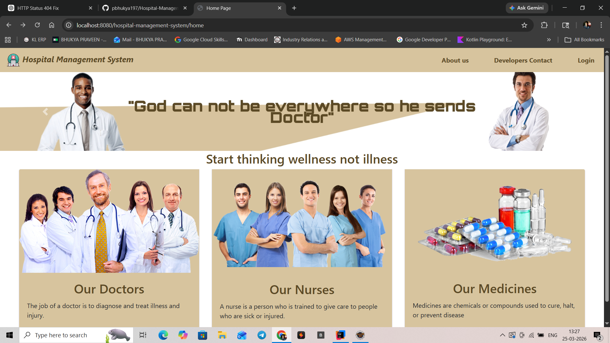
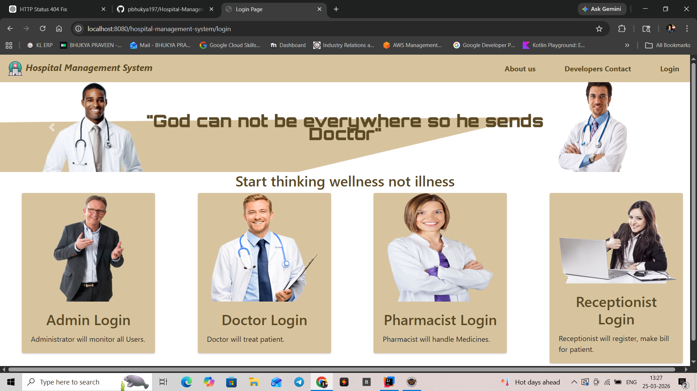

# 🏥 Hospital Management System

A full-stack web application designed to streamline hospital operations by managing patients, doctors, pharmacy, and billing efficiently.

---

## 🚀 Key Modules

### 👨‍💼 Admin Module

* Manage all users (Doctors, Receptionists, Pharmacists)
* Monitor system activities
* Maintain overall system control

---

### 👨‍⚕️ Doctor Module

* View patient details
* Update treatment status
* Manage patient diagnosis and prescriptions

---

### 💊 Pharmacist Module

* Manage medicine inventory
* Track medicine usage
* Update stock availability

---

### 🧾 Receptionist Module

* Register new patients
* Maintain patient records
* Generate bills automatically

---

## 🖥️ User Interface

The system provides a clean dashboard with role-based login:

* Admin Login
* Doctor Login
* Pharmacist Login
* Receptionist Login

Each module has a dedicated interface for its functionality.

---

## 🛠️ Tech Stack

* **Backend:** Spring Boot, Spring MVC
* **Frontend:** JSP, HTML, CSS, Bootstrap, JavaScript
* **Database:** MySQL
* **ORM:** Hibernate / JPA
* **Build Tool:** Maven

---

## ⚙️ Setup Instructions

### 1️⃣ Clone the Repository

```bash
git clone https://github.com/pbhukya197/Hospital_Management_System-Spring-Boot--.git
```

### 2️⃣ Configure Database

```sql
CREATE DATABASE hospital_db;
```

Update `application.properties`:
```properties
spring.datasource.url=jdbc:mysql://localhost:3306/hospital_db
spring.datasource.username=root
spring.datasource.password=your_password
```

---

### 3️⃣ Run the Application

```bash
mvn spring-boot:run
```

---

## 📸 Screenshots

### 🔹 Home Page


### 🔹 Login Page

---

## 📄 Documentation

* JavaDoc available in: `target/site/apidocs`

---

## 🌟 Future Enhancements

* Role-based authentication & authorization (Spring Security)
* REST API support
* Cloud deployment (AWS / Docker)
* Email notifications

---

## 👨‍💻 Author

**Bhukya Praveen**
B.Tech CSE (Cloud & Edge Computing)
Skills: Java, Spring Boot, AWS, MySQL

---

## 📌 License

This project is open-source and available under the MIT License.
